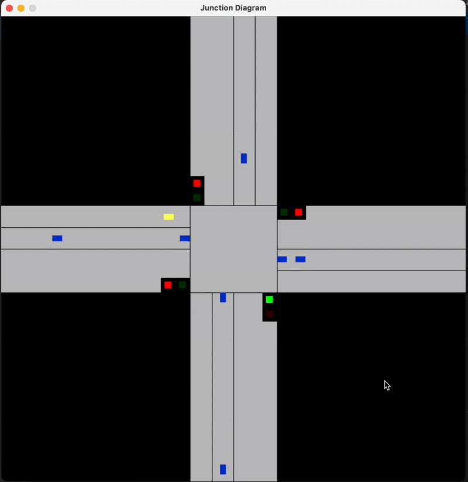

# Traffic Queue Simulator

A real-time traffic junction simulation, using queues to model incoming and outgoing traffic dynamically.



## Features

- Real-time vehicle movement based on queue simulation.
- Traffic light system to regulate vehicle flow.
- Dynamic network communication for external traffic data integration.

## Prerequisites

To run this simulation, you need:

- GCC or G++ compiler
- SDL2 library

#### On Mac:

1. Install Homebrew if not already done so:
/bin/bash -c "$(curl -fsSL https://raw.githubusercontent.com/Homebrew/install/HEAD/install.sh)"

2. Install SDL2 and additional libraries:
brew install sdl2
brew install sdl2_image sdl2_ttf sdl2_mixer sdl2_net

## Running the Project

1. Clone the repository:
```bash
git clone https://github.com/yourusername/dsa_queue_simulator.git
cd dsa_queue_simulator
```

2. Compile and run the programs one by one:

First, the network receiver to establish the connection:
```bash
gcc receiver.c -o receiver && ./receiver
```

Then, the simulator to render the junction:
```bash
gcc simulator.c -o simulator -Wall -Wextra -I./include -I/opt/homebrew/include $(sdl2-config --cflags --libs) -lSDL2 -lSDL2_ttf -lpthread && ./simulator
```

Finally, the generator to populate the road:
```bash
gcc traffic_generator.c -o traffic_generator && ./traffic_generator
```

## Project Structure

```
Traffic-Simulation/
├── receiver.c        # Network file
├── traffic_generator.c        # Generates vehicles
├── simulator.c        # Implements everything and runs them
└── README.md
```

## Contributions

Feel free to fork the repository, submit issues, and create pull requests to improve the simulation.

## References

1. SDL2 Documentation: https://wiki.libsdl.org/
2. Beej's Guide to Network Programming: https://beej.us/guide/bgnet/html/split/intro.html#audience

## License

This project is open-source and available under the MIT License.